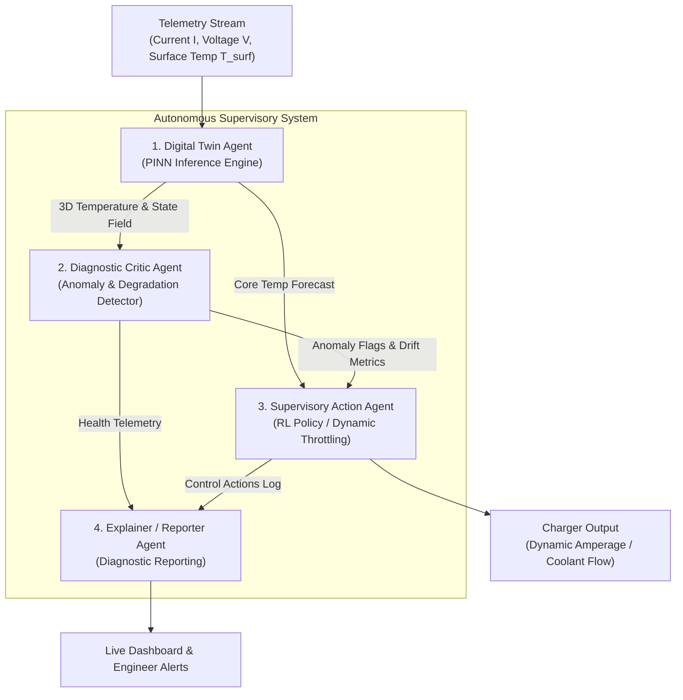
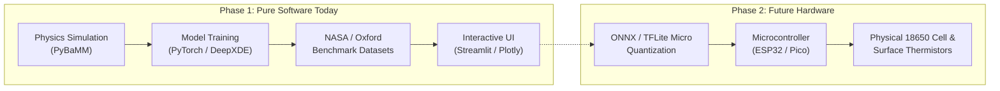

# Project Proposal & Technical Specification
## Physics-Informed Neural Digital Twin for Battery Safety and Fast-Charging Optimization

---

## 1. Executive Summary & One-Paragraph Pitch

> **Project Pitch:**  
> This project develops an AI-powered **Physics-Informed Neural Digital Twin** that acts like a real-time "X-ray" for lithium-ion batteries (used in electric vehicles, smartphones, and energy storage) to detect dangerous internal core temperatures and fire risks that physical sensors cannot reach without puncturing the cell. Running entirely in software, the system takes simple, non-invasive exterior surface measurements—voltage, current, and outer casing temperature—and processes them through a deep neural network whose loss function is mathematically anchored to fundamental partial differential equations (PDEs) of heat conduction and electrochemistry. This allows the model to infer the invisible, internal 3D thermal and chemical degradation maps in just a few milliseconds—over 1,000 times faster than traditional heavy finite-element simulations. An autonomous multi-agent supervisory software loop continuously monitors these internal heatmaps to detect anomalies and dynamically throttle charging rates in real time, delivering the fastest possible charging speeds while eliminating thermal runaway hazards. Built and validated entirely in software today using open-source battery simulators (`PyBaMM`) and public NASA benchmark datasets, the resulting model can be directly exported onto low-cost edge microcontrollers in the future to power physical, next-generation smart Battery Management Systems (BMS).

---

## 2. The Real-World Problem & Industrial Context

### 2.1 The Sensor Blind Spot & Thermal Lag
Modern battery packs rely on external monitoring. Because placing physical thermocouple probes inside a sealed cylindrical cell would cause internal short circuits and destroy the cell, sensors are glued **exclusively to the outer metal casing**.

```
[ Outside Casing ]  ─── Sensor reads 38°C (Appears safe & cool!)
      │
   9 mm deep
      │
[ Core of Cell ]    ─── Core temperature reaches 76°C (Separator melting, gas formation!)
```

Battery materials are poor thermal conductors. By the time heat from an internal microscopic flaw reaches the exterior casing, the core is already in an irreversible exothermic breakdown known as **Thermal Runaway**, leading to fire or explosion within seconds.

### 2.2 Case Study: The $2 Billion Chevy Bolt Recall
In 2021, General Motors had to recall over 140,000 Chevrolet Bolt EVs at a cost of roughly \$2 Billion. Manufacturing defects caused localized internal micro-shorts during overnight charging. Because the existing Battery Management Systems (BMS) only saw normal surface temperatures right up until seconds before ignition, the vehicles could not predict or prevent the fires.

### 2.3 The Daily Real-Time Dilemma: Fast-Charging Throttling
Electric vehicle manufacturers (Tesla, Hyundai, BYD) face an ongoing trade-off:
* **Consumer Demand:** Drivers want to charge from 10% to 80% in **15 minutes** at 350 kW DC Fast Chargers.
* **Manufacturer Safety Margin:** Because engineers cannot see inside the cell core, they are forced to program conservative, static throttling curves that drop the charging rate down to 50 kW after 8 minutes, turning a 15-minute stop into a 45-minute delay.

---

## 3. How Machine Learning is Used

A common misconception is that neural networks are separate from machine learning. **A neural network is the core engine of Deep Learning, which is a major subfield of Machine Learning.** 

This project integrates three complementary branches of Machine Learning:

```
┌─────────────────────────────────────────────────────────────────┐
│                       MACHINE LEARNING                          │
│                                                                 │
│  ┌────────────────────────┐  ┌───────────────┐  ┌────────────┐  │
│  │     Deep Learning      │  │  Unsupervised │  │Reinforce-  │  │
│  │ (Physics-Informed NNs) │  │   Anomaly ML  │  │ment Learn. │  │
│  │                        │  │               │  │  (Agents)  │  │
│  │ Inverts surface data   │  │ Flags defect  │  │ Real-time  │  │
│  │ into 3D heat maps      │  │ drift/shorts  │  │ throttling │  │
│  └────────────────────────┘  └───────────────┘  └────────────┘  │
└─────────────────────────────────────────────────────────────────┘
```

### 3.1 Physics-Informed Neural Network (PINN) / Neural Operator
Standard deep learning requires millions of ground-truth labels. Because we cannot stick thermometers into the cores of millions of cells to get labels, the neural network is trained using **Physics-Informed Loss**:

$$\mathcal{L}_{\text{total}} = \mathcal{L}_{\text{surface\_data}} + \lambda \cdot \mathcal{L}_{\text{physics}}$$

Where the physics penalty $\mathcal{L}_{\text{physics}}$ penalizes violations of Fourier's Heat Conduction Law:

$$\rho c_p \frac{\partial T}{\partial t} - \nabla \cdot (k \nabla T) = Q_{\text{gen}}(I, V)$$

If the network predicts an internal temperature that violates the conservation of energy, the optimizer penalizes the network weights. As a result, the model learns physically accurate internal temperatures purely from surface inputs.

### 3.2 Unsupervised Anomaly Detection
* **Models:** Isolation Forest, One-Class SVM, or Mahalanobis Distance on latent feature representations.
* **Function:** Monitors the digital twin outputs across consecutive charging cycles. If one cell's internal core temperature rises significantly faster than its peers under identical current, the model flags an internal micro-short circuit without needing pre-labeled disaster data.

### 3.3 Reinforcement Learning (RL) Supervisory Control
* **Models:** Proximal Policy Optimization (PPO) or Deep Q-Networks (DQN).
* **Function:** Acts as an autonomous agent that maximizes charging speed (reward) while enforcing a strict safety barrier: never allowing the predicted core temperature to exceed $60^\circ\text{C}$ (heavy penalty).

---

## 4. Multi-Agent Software Architecture

The software is structured as four cooperating agents communicating in real time:



1. **Digital Twin Agent (Observer):** Takes live $I(t), V(t), T_{\text{surface}}(t)$ and outputs the predicted 3D internal temperature field in $<2\text{ ms}$.
2. **Diagnostic Critic Agent (Watchdog):** Compares predicted thermal gradients against baseline models to spot localized abnormalities, degradation, or sensor drift.
3. **Supervisory Action Agent (Controller):** Adjusts charger current in real time to maintain maximum safe charging rates without crossing safety thresholds.
4. **Explainer Agent (Communicator):** Generates structured diagnostic summaries for engineers explaining why power was adjusted.

---

## 5. Development Roadmap: Software Today, Hardware Tomorrow



### Phase 1: Pure Software (Current Scope)
* **No hardware required.** Runs on a standard laptop or free Google Colab.
* **Simulation Tool:** `PyBaMM` (Python Battery Mathematical Modelling) generates multi-rate charging cycles.
* **Datasets:** NASA PCoE Battery Aging Dataset, Oxford Battery Degradation Dataset.
* **Deliverable:** An interactive Streamlit dashboard rendering animated 3D heatmaps of battery cells during fast charging.

### Phase 2: Future Hardware Upgrade (When Ready)
1. Export the trained model to `ONNX` or `TensorFlow Lite for Microcontrollers`.
2. Flash the binary onto an inexpensive microcontroller (\$5–\$10 ESP32 or Raspberry Pi Pico).
3. Connect 2 digital thermistors (DS18B20) and an INA219 current/voltage sensor to a real 18650 lithium-ion cell holder.
4. Deploy as a physical, real-time edge Battery Management System (BMS).

---

## 6. 4-Week Implementation Plan

| Week | Phase | Key Tasks | Deliverables |
| :--- | :--- | :--- | :--- |
| **Week 1** | **Simulation Sandbox** | Install `pybamm`. Generate 1C, 2C, 3C charging cycle profiles. Plot surface vs. core temperatures. | Baseline synthetic dataset & simulation pipeline. |
| **Week 2** | **PINN Architecture** | Build a 1D/2D heat-equation PINN in `DeepXDE` / `PyTorch`. Implement the physics-informed loss function. | Working neural network converging on physics loss. |
| **Week 3** | **Inverse State Estimation** | Train model using only surface boundary inputs. Validate against NASA battery dataset cycles. | Accurate internal core temperature predictions ($<1.5^\circ\text{C}$ RMSE). |
| **Week 4** | **Agents & Dashboard** | Build the anomaly critic and the interactive Streamlit 3D visualization dashboard. Record demo. | Complete GitHub repository, UI demo, and documentation. |

---

## 7. AI Video Generation Prompts

### 7.1 Single Master Prompt (For Google Veo / Sora / Runway Gen-3)
```text
Cinematic 4K hyper-realistic 3D render, cross-section cutaway of a sleek electric vehicle fast-charging at night. The camera smoothly glides in macro close-up into the underbody battery pack down to a single cylindrical lithium-ion battery cell. The outer metal casing shows a translucent digital HUD overlay reading a cool blue "Surface Temp: 35°C (Safe)". As the camera peers inside the cell layers, the internal core is violently glowing molten red and amber, pulsing with trapped heat at "Core Temp: 78°C (Critical Hotspot)". Suddenly, glowing cyan neural network vector lines and mathematical physics equations wrap around the battery core, acting like an AI X-ray scan. The glowing AI lines stabilize the heat, shifting the fiery red core back to a safe ambient orange-cyan gradient. Dynamic lighting, photorealistic industrial tech aesthetics, Unreal Engine 5 style, smooth cinematic slow-motion.
```

### 7.2 Multi-Scene Storyboard Script (For 30-Second Explainer)
```text
Create a 30-second cinematic video storyboard explaining an AI breakthrough for electric vehicle battery safety. Break it down into 4 detailed scenes with visual descriptions, camera motion, and voiceover:

- Scene 1 (0-7s): A modern EV plugged into a high-speed highway supercharger during a hot day. Zoom in on the charging dashboard showing full power.
Voiceover: "Fast charging is the future of electric vehicles... but it hides a dangerous blind spot."

- Scene 2 (7-15s): Seamless 3D X-ray transition entering the battery pack. Show the outer surface of a battery cell looking calm and blue (35°C), while the microscopic inner chemical core is glowing dangerous molten red (75°C), threatening fire.
Voiceover: "Exterior sensors only see the cool outside casing. Deep inside the core, trapped heat risks battery degradation and thermal runaway."

- Scene 3 (15-23s): A digital twin appears—holographic neural network nodes and heat-flow equations overlaying the battery cell, estimating the core temperature in real time without physical internal sensors.
Voiceover: "Meet the Physics-Informed Neural Digital Twin: an AI that gives engineers X-ray vision in milliseconds."

- Scene 4 (23-30s): The AI adjusts the charging current in real time. The core heat cools to a stable, safe temperature while the car continues fast-charging safely. Cut to the car driving smoothly into the sunset.
Voiceover: "Maximum charging speed. Zero fire risk. Powered purely by software."
```
